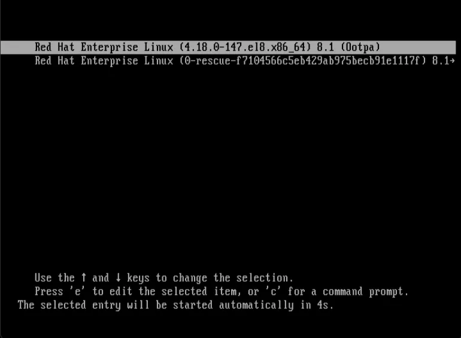
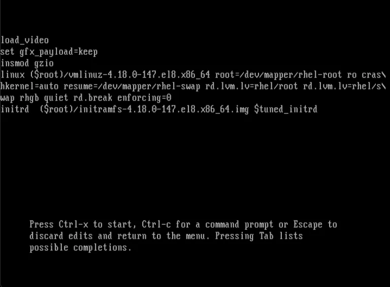
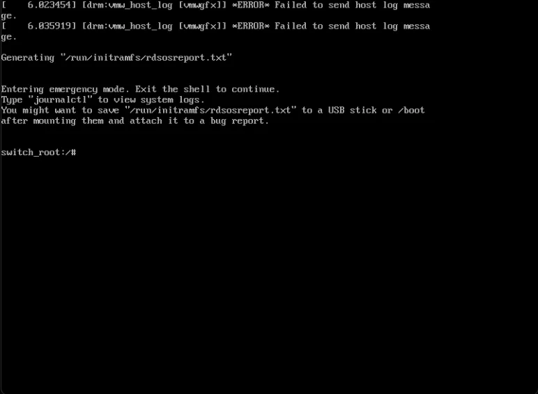
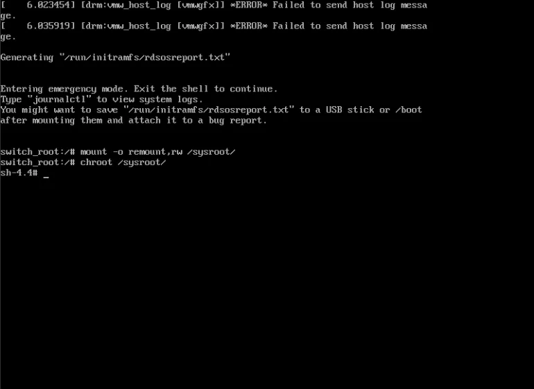
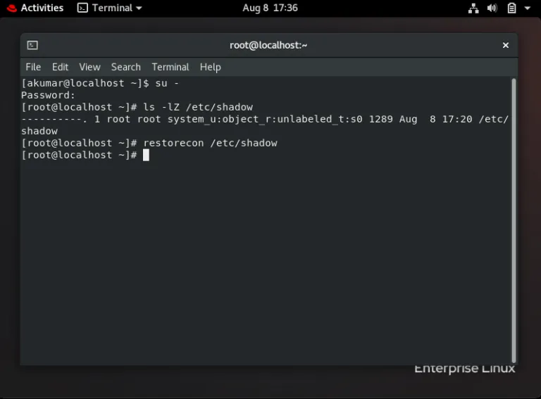
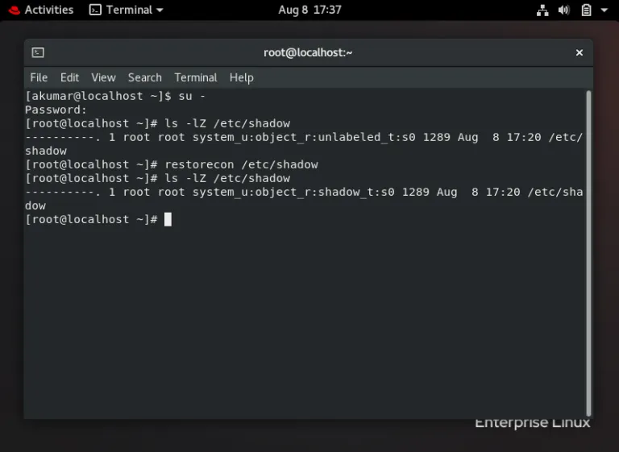

## How to recover a root password in Red Hat-based Linux systems
1. Reboot OS & open GRUB Boot Loader
```bash
reboot
```
When boot loader menu appears, quickly press ‘e’ on your keyboard.


2. Modify boot sequence
Add at the end of the second last line: `rd.break enforcing=0`
`rd` means ram disk and `rd.break` will land us to the ram disk. And `enforcing=0` will disable the SELinux.


After you’ve done editing press `Ctrl+x`. This would land you another screen with a shell labeled `switch_root:/#`, similar to as shown in the image below;



3. Remount /sysroot with read & write privileges
```bash
mount -o remount,rw /sysroot 
```
4. Change apparent root directory to /sysroot
```bash
chroot /sysroot/
```


5. Reset root password
```bash
passwd root
```
6. Exit & Login
7. Reset /etc/shadow file’s SELinux label
```bash
restorecon /etc/shadow
ls -lZ /etc/shadow
```



