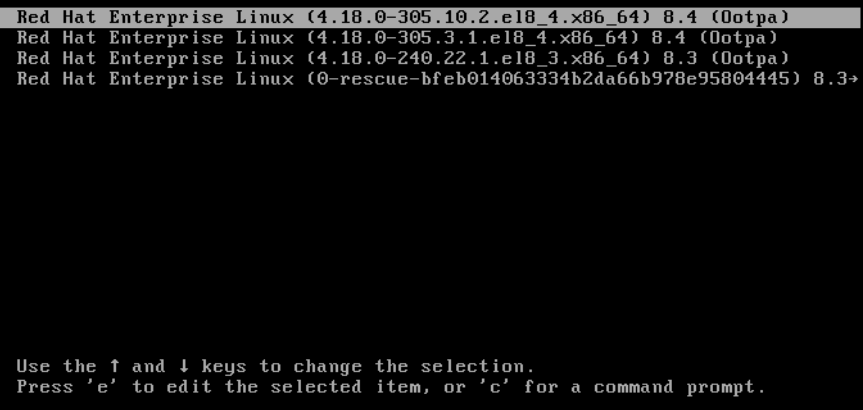
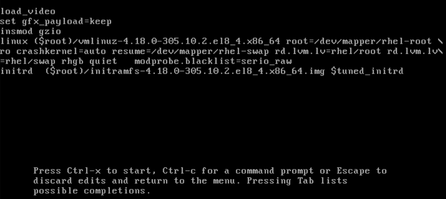

## Managing, monitoring, and updating the kernel

### The linux kernel
1. Displaying contents of a kernel package
```bash
yum repoquery kernel-core
```
2. Display the list of files in a package:
```bash
yum repoquery -l kernel-core-0:4.18.0-147.8.1.el8_1.x86_64
```
3. Installing specific kernel versions
```bash
yum install kernel-{version}
```
4. Updating the kernel
```bash
 yum update kernel
 ```
### Setting a kernel as default
* Setting the kernel as default, using the `grubby` tool
    - List the boot entries using the id argument and then set an intended kernel as default:
```bash
grubby --info ALL | grep id
grubby --set-default /boot/vmlinuz-<version>.<architecture>
```
* Setting the default kernel for only the next boot
```bash
grub2-reboot <index|title|id>
```

### Managing kernel modules
#### Introduction to kernel modules
On modern systems, kernel modules are automatically loaded when needed. However, in some cases it is necessary to load or unload modules manually.

#### Kernel module dependencies
```bash
depmod
```

#### Listing installed kernel modules
```bash
grubby --info=ALL | grep title
```

#### Listing currently loaded kernel modules
```bash
lsmod
```
#### Listing all installed kernels
```bash
grubby --info=ALL | grep ^kernel

```
#### Displaying information about kernel modules
```bash
modinfo <KERNEL_MODULE_NAME>
```
```bash
modinfo virtio_net
```
#### Loading kernel modules at system runtime
1. Select a kernel module you want to load.
The modules are located in the `/lib/modules/$(uname -r)/kernel/<SUBSYSTEM>/` directory.
2. Load the relevant kernel module:
```bash
modprobe <MODULE_NAME>
```
**Verification**
```bash
lsmod | grep <MODULE_NAME>
```
#### Unloading kernel modules at system runtime

```bash
 modprobe -r <MODULE_NAME>
```
#### Unloading kernel modules at early stages of the boot process
Procedure:
1. Boot the system into the boot loader.
2. Use the cursor keys to highlight the relevant boot loader entry.
3. Press the e key to edit the entry.


4. Use the cursor keys to navigate to the line that starts with linux.
5. Append `modprobe.blacklist=module_name` to the end of the line.



**Verification**
```bash
lsmod | grep serio_raw
```
#### Loading kernel modules automatically at system boot time
1. Create a configuration file for the module:
```bash
echo <MODULE_NAME> > /etc/modules-load.d/<MODULE_NAME>.conf
```
#### Preventing kernel modules from being automatically loaded at system boot time
1. Create a configuration file serving as a denylist:
```bash
touch /etc/modprobe.d/denylist.conf
```
```bash
# Prevents <KERNEL-MODULE-1> from being loaded
blacklist <MODULE-NAME-1>
install <MODULE-NAME-1> /bin/false

# Prevents <KERNEL-MODULE-2> from being loaded
blacklist <MODULE-NAME-2>
install <MODULE-NAME-2> /bin/false
...
```
2. Create a backup copy of the current initial RAM disk image before rebuilding:
```bash
cp /boot/initramfs-$(uname -r).img /boot/initramfs-$(uname -r).bak.$(date +%m-%d-%H%M%S).img
```
3. Generate a new initial RAM disk image to apply the changes:
```bash
dracut -f -v
```
* If you build an initial RAM disk image for a different kernel version than your system currently uses, specify both target `initramfs` and kernel version:
```bash
dracut -f -v /boot/initramfs-<TARGET-VERSION>.img <CORRESPONDING-TARGET-KERNEL-VERSION>
```
4. Restart the system:
```bash
reboot
```

##  Working with sysctl and kernel tunables
### What is a kernel tunable?
Kernel tunables are used to customize the behavior of Red Hat Enterprise Linux at boot, or on demand while the system is running.
### How to work with kernel tunables
There are three ways to modify kernel tunables.

1. Using the `sysctl` command
2. By manually modifying configuration files in the `/etc/sysctl.d/` directory
3. Through a shell, interacting with the virtual file system mounted at `/proc/sys`
### Using the sysctl command
1. Listing variables
```bash
sysctl -a
```
2. Reading variables
```bash
sysctl kernel.version
```
3. Writing variables temporarily
```bash
sysctl <tunable class>.<tunable>=<value>
```
4. Writing variables permanently
```bash
sysctl -w <tunable class>.<tunable>=<value> >> /etc/sysctl.conf
```
### What tunables can be controlled?
Tunables are divided into groups by kernel sybsystem. A Red Hat Enterprise Linux system has the following classes of tunables:
**Table of sysctl interfaces**
| Class     | Subsystem                                         |
|-----------|---------------------------------------------------|
| abi       | **Execution domains and personalities**            |
| crypto    | **Cryptographic interfaces**                       |
| debug     | **Kernel debugging interfaces**                    |
| dev       | **Device specific information**                    |
| fs        | **Global and specific filesystem tunables**        |
| kernel    | **Global kernel tunables**                         |
| net       | **Network tunables**                               |
| sunrpc    | **Sun Remote Procedure Call (NFS)**                |
| user      | **User Namespace limits**                          |
| vm        | **Tuning and management of memory, buffer, and cache** |

### Network interface tunables
The most frequently used directories are:
1. `/proc/sys/net/core/`
2. `/proc/sys/net/ipv4/`

```bash
echo 1 > /proc/sys/net/ipv4/icmp_echo_ignore_all
```
### Global kernel tunables
Global kernel tunables are included in the `/proc/sys/kernel/` directory 

### [Listing of kernel parameters and values](https://access.redhat.com/documentation/en-us/red_hat_enterprise_linux/7/html/kernel_administration_guide/listing_of_kernel_parameters_and_values)

### References
[Kernel Configuration](https://access.redhat.com/documentation/en-us/red_hat_enterprise_linux/8/html/managing_monitoring_and_updating_the_kernel/index)

[Compiling custom kernel modules](https://access.redhat.com/documentation/en-us/red_hat_enterprise_linux/8/html/managing_monitoring_and_updating_the_kernel/managing-kernel-modules_managing-monitoring-and-updating-the-kernel#proc_compiling-custom-kernel-modules_managing-kernel-modules)

[Working with sysctl and kernel tunables](https://access.redhat.com/documentation/en-us/red_hat_enterprise_linux/7/html/kernel_administration_guide/working_with_sysctl_and_kernel_tunables)
