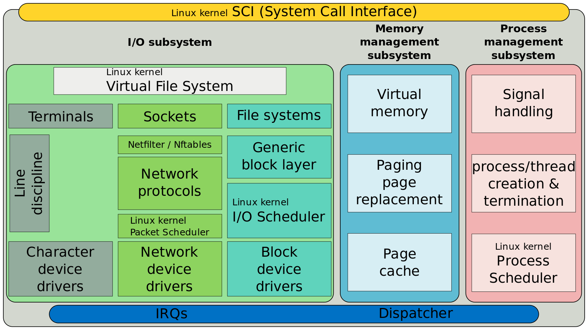
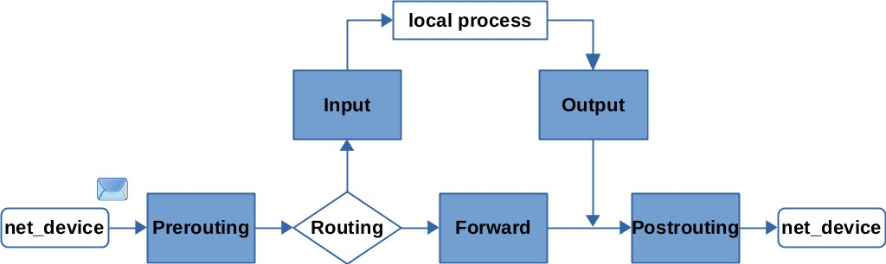
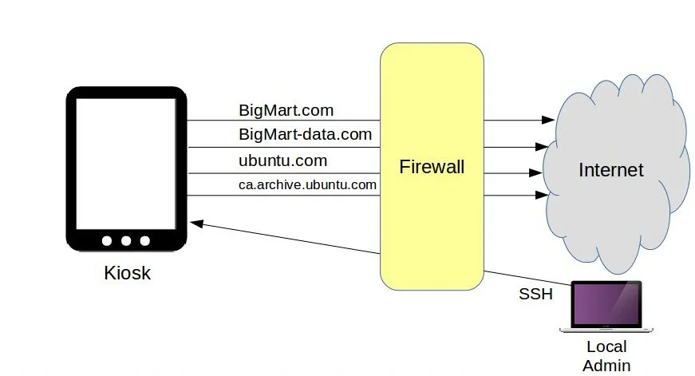

## Linux subsystem


## Netfilter hooks

## Configure HTTP access using firewalld
1. check status
```bash
firewall-cmd --state
```
2. Check current allowed services
```bash
firewall-cmd --list-services
```
3. Add http service
```bash
firewall-cmd --permanent --add-port=80/tcp
firewall-cmd --permanent --add-port=443/tcp
```

## iptables example
iptables uses tables, chains, and rules to filter network traffic. The tables categorize the nature of the rules, while chains define when these rules are applied.


```bash
iptables -A OUTPUT -p tcp -d bigmart.com -j ACCEPT
iptables -A OUTPUT -p tcp -d bigmart-data.com -j ACCEPT
iptables -A OUTPUT -p tcp -d ubuntu.com -j ACCEPT
iptables -A OUTPUT -p tcp -d ca.archive.ubuntu.com -j ACCEPT
iptables -A OUTPUT -p tcp --dport 80 -j DROP
iptables -A OUTPUT -p tcp --dport 443 -j DROP
iptables -A INPUT -p tcp -s 10.0.3.1 --dport 22 -j ACCEPT
iptables -A INPUT -p tcp -s 0.0.0.0/0 --dport 22 -j DROP

```
### Make it permanent
```bash
sudo iptables-save | sudo tee /root/my.active.firewall.rules
iptables-restore < /root/my.active.firewall.rules

```

## Basic iptables syntax
`iptables [-t table] -[A/I/D] chain rule-specification [j target]`

* `-t table` specifies the table (filter, nat, mangle).
* `-A/I/D adds`, inserts, or deletes a rule.
* `chain` is the chain (INPUT, FORWARD, OUTPUT) where the rule is placed.
* `rule-specification` defines the conditions for the rule.
* `-j target` specifies the target action (ACCEPT, DROP, REJECT).

## Example Use cases
1. ### To allow ssh 
```bash
iptables -A INPUT -p tcp --dport 22 -s 192.168.1.50 -j ACCEPT
```
2. ### Blocking a Specific IP Address
```bash
iptables -A INPUT -s 10.10.10.10 -j DROP
```

3. ### Port Forwarding
```bash
iptables -t nat -A PREROUTING -p tcp --dport 80 -j REDIRECT --to-port 8080
```

4. ### Limiting Connections Per IP
To prevent potential denial-of-service attacks, you might want to limit the number of concurrent connections per IP.

```bash
ptables -A INPUT -p tcp --syn --dport 80 -m connlimit --connlimit-above 20 -j DROP
```

5. ### Logging Dropped Packets
For diagnostic purposes, it’s often useful to log packets that are dropped.
```bash
iptables -A INPUT -j LOG --log-prefix "IPTables-Dropped: " --log-level 4
iptables -A INPUT -j DROP
```
## firewalld
### The philosophy and design of firewalld
firewalld is built around the concept of ‘zones’ and ‘services’, which abstract the traditional approach of iptables into more manageable components. 
1. **Zones**: Represent the level of trust for network connections and devices. For example, a **public** zone can be less trusted, allowing limited access.
2. **Services**: ports and protocols as a single entity, referred to as a service

### Example
1. ### Adding a service to a zone
```bash
firewall-cmd --zone=public --add-service=http --permanent
```
2. ### Opening a specific port
```bash
firewall-cmd --zone=public --add-port=8080/tcp --permanent
```
3. ### Removing a service from a zone
```bash
firewall-cmd --zone=public --remove-service=ssh --permanent
```
4. ### Listing active rules
```bash
firewall-cmd --zone=public --list-all
```
5. ### Blocking an IP address
```bash
firewall-cmd --zone=public --add-rich-rule='rule family="ipv4" source address="10.10.10.10" reject' --permanent
```
6. ### Enabling Masquerading
```bash
firewall-cmd --zone=public --add-masquerade --permanent
```

## ufw - Uncomplicated Firewall
1. Enable
```bash
sudo ufw enable
```
2. To open a port (SSH in this example):
```bash
sudo ufw allow 22
```
3. Rules can also be added using a numbered format:
```bash
sudo ufw insert 1 allow 80
```
4. Similarly, to close an opened port:
```bash
sudo ufw deny 22
```
5. To remove a rule, use delete followed by the rule:
```bash
sudo ufw delete deny 22
```
6. allows SSH access from host 192.168.0.2 to any IP address on this host:
```bash
sudo ufw allow proto tcp from 192.168.0.2 to any port 22
```
7. Disable
```bash
sudo ufw disable
```
8. Status
```bash
sudo ufw status
```
### ufw Application Integration
```bash
sudo ufw app list
```
```bash
sudo ufw allow Samba
ufw allow from 192.168.0.0/24 to any app Samba
```
### ufw Masquerading
1. In `/etc/default/ufw` change the `DEFAULT_FORWARD_POLICY` to `ACCEPT`

2. Change `net/ipv4/ip_forward=1 `in `/etc/ufw/sysctl.conf`

### Logs
```bash
sudo ufw logging on
```
equivalent `iptables`
```bash
sudo iptables -A INPUT -m state --state NEW -p tcp --dport 80 \
-j LOG --log-prefix "NEW_HTTP_CONN: "
```
