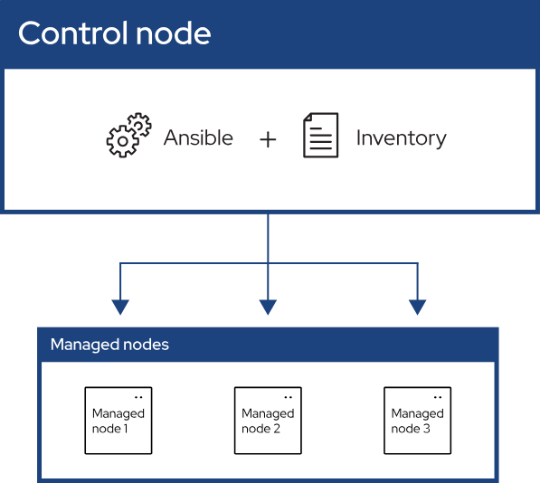

# Ansible

## Building Ansible inventories
### Inventory basics: formats, hosts, and groups
A basic INI `/etc/ansible/hosts`
```bash
mail.example.com

[webservers]
foo.example.com
bar.example.com

[dbservers]
one.example.com
two.example.com
three.example.com
```


### What is Default groups?
Even if you do not define any groups in your inventory file, Ansible creates two default groups: `all` and `ungrouped`. 

### Hosts in multiple groups
* You can put each host in more than one group. 

ou can create groups that track:

* **What** - An application, stack or microservice (for example, database servers, web servers, and so on).

* **Where** - A datacenter or region, to talk to local DNS, storage, and so on (for example, east, west).

* **When** - The development stage, to avoid testing on production resources (for example, prod, test).

```bash
[ungrouped]
hosts = mail.example.com

[webservers]
hosts = foo.example.com, bar.example.com

[dbservers]
hosts = one.example.com, two.example.com, three.example.com

[east]
hosts = foo.example.com, one.example.com, two.example.com

[west]
hosts = bar.example.com, three.example.com

[prod]
hosts = foo.example.com, one.example.com, two.example.com

[test]
hosts = bar.example.com, three.example.com

```

### Adding ranges of hosts

```bash
[webservers]
www[01:50].example.com
```

### Passing multiple inventory sources
To target two inventory sources from the command line:
```bash
ansible-playbook get_logs.yml -i staging -i production
```

## Adding variables to inventory
### Assigning a variable to one machine: **host variables**

You can easily assign a variable to a single host and then use it later in playbooks. 
```bash
[atlanta]
host1 http_port=80 maxRequestsPerChild=808
host2 http_port=303 maxRequestsPerChild=909
```
Connection variables also work well as host variables:
```bash
[targets]

localhost              ansible_connection=local
other1.example.com     ansible_connection=ssh        ansible_user=myuser
other2.example.com     ansible_connection=ssh        ansible_user=myotheruser
```

### Inventory aliases
In this example, running Ansible against the host alias `jumper` will connect to 192.0.2.50 on port 5555. 
```bash
jumper ansible_port=5555 ansible_host=192.0.2.50
```


### Assigning a variable to many machines: **group variables**
If all hosts in a group share a variable value, you can apply that variable to an entire group at once.
```bash
[atlanta]
host1
host2

[atlanta:vars]
ntp_server=ntp.atlanta.example.com
proxy=proxy.atlanta.example.com
```
