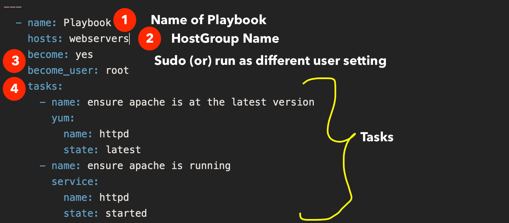

1. Install httpd

```yaml
---
  - name: Playbook
    hosts: webservers
    become: yes
    become_user: root
    tasks:
      - name: ensure apache is at the latest version
        yum:
          name: httpd
          state: latest
      - name: ensure apache is running
        service:
          name: httpd
          state: started
```



2. create user and set password
```yaml
---
- name: Create user and set password
  hosts: your_target_hosts
  become: yes  # Run tasks with root privileges

  vars:
    new_username: "newuser"
    new_user_password: "newpassword123"  # You should use a more secure method to handle passwords

  tasks:
    - name: Create user "{{ new_username }}"
      user:
        name: "{{ new_username }}"
        state: present
        password: "{{ new_user_password | password_hash('sha512') }}"  # Hash the password using SHA-512
        shell: /bin/bash
        createhome: yes  # Create the user's home directory if it doesn't exist
        update_password: on_create  # Update the password only if the user is created

    - name: Set password for user "{{ new_username }}"
      ansible.builtin.shell: "echo '{{ new_username }}:{{ new_user_password }}' | chpasswd"
      become: yes  # Run the command as root

```

3. Setup firewalld
```yaml
---
- name: Configure firewalld and open ports
  hosts: your_target_hosts
  become: yes  # Run tasks with root privileges

  tasks:
    - name: Install firewalld package
      yum:
        name: firewalld
        state: present

    - name: Ensure firewalld service is enabled and running
      service:
        name: firewalld
        state: started
        enabled: yes

    - name: Open SSH port 22 in firewalld
      firewalld:
        service: ssh
        state: enabled

    - name: Open HTTP port 80 in firewalld
      firewalld:
        port: 80/tcp
        state: enabled

```
