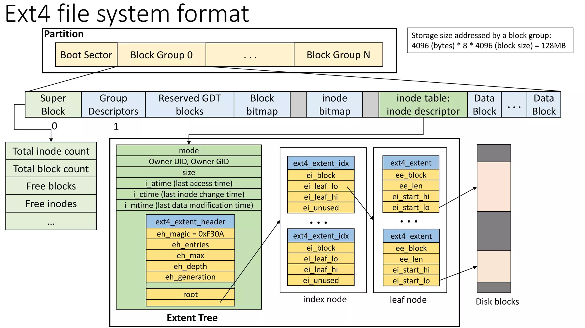

## Filesystem Concept

## EXT4
### Layout

An ext4 filesystem is divided into block groups. Each block group has 8*blocksize (in bytes) number of blocks in it.

### Large filesystems
Ext4 uses 48-bit internal addressing, making it theoretically possible to allocate files up to 16 TiB on filesystems up to 1,000,000 TiB (1 EiB).

_Note_: Ext4 uses little endian notation.

### Block size
In a file system, a _block_ is the largest contiguous amount of disk space that can be allocated to a file and also the largest amount of data that can be transferred in a single I/O operation.   
```bash
tune2fs -l /dev/sda | grep 'Block size:'
```

### Reserved blocks
By default, 5% of the filesystem blocks will be reserved for the super-user, to avoid fragmentation and "allow root-owned daemons to continue to function correctly after non-privileged processes are prevented from writing to the filesystem"

To totally prevent reserving blocks upon filesystem creation, use:
```bash
mkfs.ext4 -m 0 /dev/sda1
```
### The Super Block
The superblock records various information about the enclosing filesystem, such as block counts, inode counts, supported features, maintenance information, and more.

### Primary and Backup Superblocks
Backup copies of the Superblock are written to some of the block groups across the disk - in case the beginning of the disk gets trashed, backup Superblocks can be used for recovery. Not all blocks groups will have a Superblock copy. 

### inode
The inode (index node) is a data structure in a Unix-style file system that describes a file-system object such as a file or a directory. Each inode stores the attributes and disk block locations of the object's data.[1] File-system object attributes may include metadata (times of last change,[2] access, modification), as well as owner and permission data.


## Practice below commands
1. Configuring UUID
    ```bash
    uuidgen  # generate UUID
    mkfs.ext4 -U UUID device
    ```

2. Create filesystem
    ```bash
    mkfs.ext4 /dev/sda1
    ```

3. Mount readonly monde
    ```bash
    sudo mount -o ro /dev/sda1 /media/readonly
    ```

4. Resizing an ext4 File System
    ```bash
    resize2fs /dev/device size
    resize2fs /dev/sda1
    ```

5. Check filesystem metadata
    ```bash
    dumpe2fs /dev/sda1
    ```
6. Find Superblock Information
    ```bash
    dumpe2fs /dev/sda5 | grep -i superblock
    ```
7. Destory superblock
    


## References
1. [Ext4 filesystem: data blocks, super blocks, inode structure](https://adil.medium.com/ext4-filesystem-data-blocks-super-blocks-inode-structure-1afb95c8e4ab)

