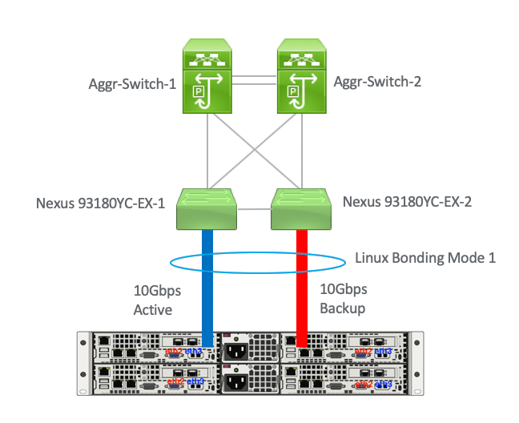
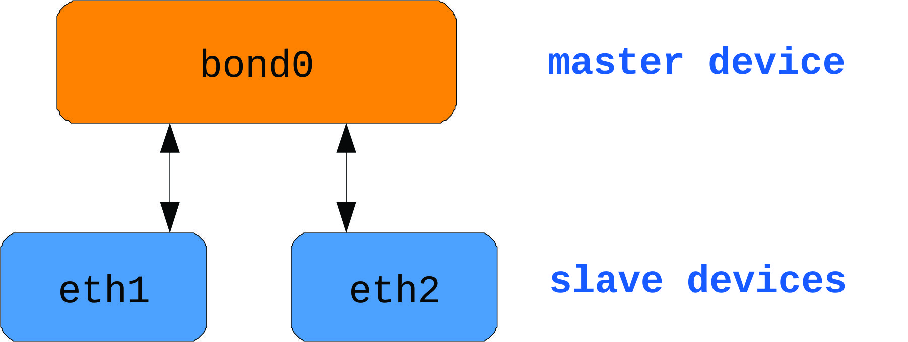

## Configure Network Bonding
> The active-backup, balance-tlb and balance-alb modes do not require any specific configuration of the switch. Other bonding modes require configuring the switch to aggregate the links. For example, a Cisco switch requires EtherChannel for Modes 0, 2, and 3, but for Mode 4 LACP and EtherChannel are required. See the documentation supplied with your switch and see https://www.kernel.org/doc/Documentation/networking/bonding.txt



## The Linux channel bonding concept
The network interfaces that are aggregated together are called _slave devices_, and the bonded logical interface is called the _master device_. 



## Upstream switch configuration depending on the bonding modes

| Bonding mode | Configuration on the switch                                    |
|--------------|----------------------------------------------------------------|
| 0 - balance-rr | Requires static EtherChannel enabled, not LACP-negotiated.     |
| 1 - active-backup | No configuration required on the switch.                        |
| 2 - balance-xor | Requires static EtherChannel enabled, not LACP-negotiated.      |
| 3 - broadcast | Requires static EtherChannel enabled, not LACP-negotiated.     |
| 4 - 802.3ad | Requires LACP-negotiated EtherChannel enabled.                 |
| 5 - balance-tlb | No configuration required on the switch.                        |
| 6 - balance-alb | No configuration required on the switch.                        |

### Configuring a network bond by using nmcli
1. Create a bond interface:
    ```bash
    nmcli connection add type bond con-name bond0 ifname bond0 bond.options "mode=active-backup"
    ```
    To additionally set a Media Independent Interface (MII) monitoring interval, add the miimon=interval option to the bond.options property, for example:

    ```bash
    nmcli connection add type bond con-name bond0 ifname bond0 bond.options "mode=active-backup,miimon=1000"
    ```
2. Display the network interfaces
    ```bash
    nmcli device status
    ```
3. Assign interfaces to the bond:
    ```bash
    nmcli connection add type ethernet slave-type bond con-name bond0-port1 ifname enp7s0 master bond0
    nmcli connection add type ethernet slave-type bond con-name bond0-port2 ifname enp8s0 master bond0
    ```
    These commands create profiles for enp7s0 and enp8s0, and add them to the bond0 connection.
4. To assign an existing connection profile to the bond:
    1. Set the master parameter of these connections to bond0:
        ```bash
        nmcli connection modify bridge0 master bond0
        nmcli connection modify bridge1 master bond0
        ```
        These commands assign the existing connection profiles named bridge0 and bridge1 to the bond0 connection.

    2. Reactivate the connections:
        ```bash
        nmcli connection up bridge0
        nmcli connection up bridge1
        ```
5. Configure the IPv4 settings:
    1. To use this bond device as a port of other devices, enter:
        ```bash
        nmcli connection modify bond0 ipv4.method disabled
        ```
    2. To use DHCP, no action is required.
    3. To set a static IPv4 address, network mask, default gateway, and DNS server to the bond0 connection, enter:
        ```bash
        nmcli connection modify bond0 ipv4.addresses '192.0.2.1/24' ipv4.gateway '192.0.2.254' ipv4.dns '192.0.2.253' ipv4.dns-search 'example.com' ipv4.method manual
        ```
6. Activate the connection:
    ```bash
    nmcli connection up bond0
    ```
7. Verify that the ports are connected, and the CONNECTION column displays the port’s connection name:
    ```bash
    nmcli device
    ```

## Comparison of Network Teaming to Bonding
[link](https://access.redhat.com/documentation/en-us/red_hat_enterprise_linux/7/html/networking_guide/sec-comparison_of_network_teaming_to_bonding)
