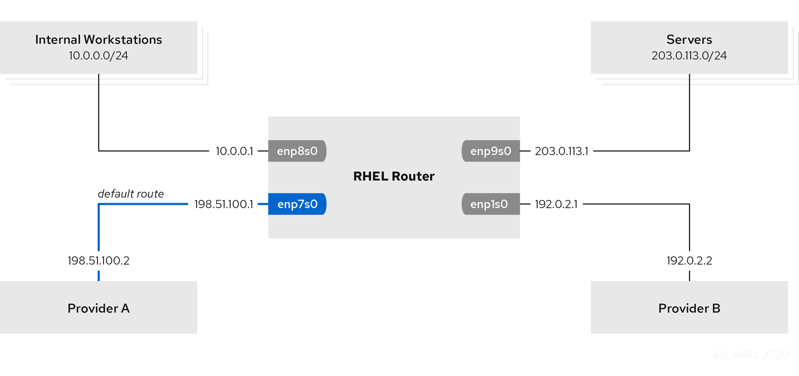

## Routing traffic from a specific subnet to a different default gateway by using nmcli


1. View network connections
```bash
nmcli
nmcli show conneciton
```

2. Rename the conneciton profile
```bash
sudo nmcli connection modify 'Wired connection 1' connection.id providerB
```

```bash
sudo nmcli connection modify 'Wired connection 2' connection.id internal-connection
```

