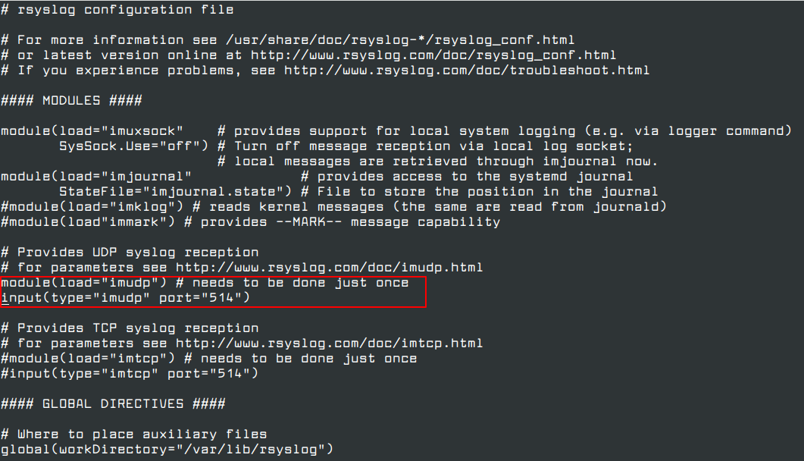
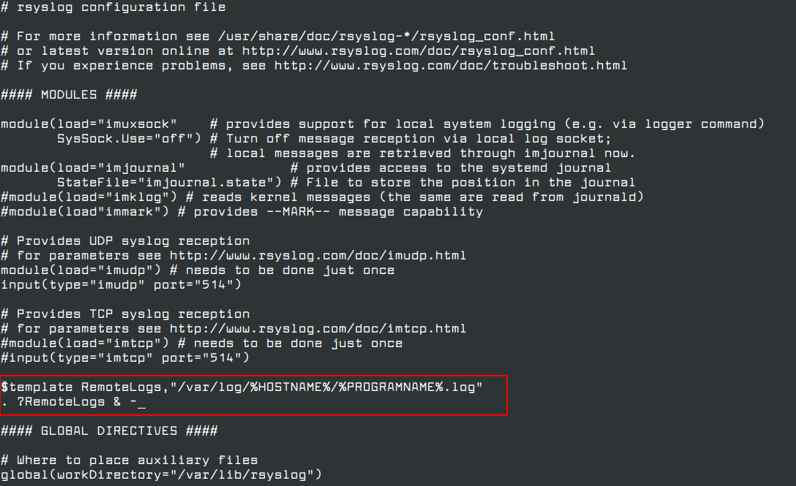
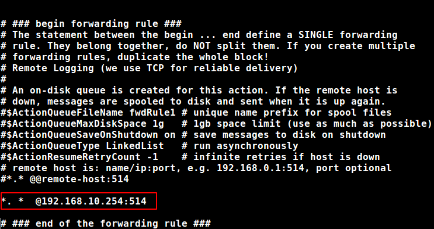

## [Configuring a remote logging solution](https://access.redhat.com/documentation/en-us/red_hat_enterprise_linux/9/html/security_hardening/assembly_configuring-a-remote-logging-solution_security-hardening)

To ensure that logs from various machines in your environment are recorded centrally on a logging server, you can configure the **Rsyslog** application to record logs that fit specific criteria from the client system to the server.

Configuration file: `/etc/rsyslog.conf`

### Configuring a server for remote logging over TCP
The Rsyslog application enables you to both run a logging server and configure individual systems to send their log files to the logging server. 
By default, `rsyslog` uses TCP on port `514`.
1. Create a new file in the `/etc/rsyslog.d/` directory named, for example, `remotelog.conf`, and insert the following content:


Reference:
https://access.redhat.com/documentation/en-us/red_hat_enterprise_linux/6/html/deployment_guide/s1-configuring_rsyslog_on_a_logging_server

[How to manage log files using logrotate](https://www.datadoghq.com/blog/log-file-control-with-logrotate/#:~:text=You%20can%20also%20use%20the,remote%20server%20for%20scheduled%20backups.)
https://www.datadoghq.com/blog/log-file-control-with-logrotate/#:~:text=You%20can%20also%20use%20the,remote%20server%20for%20scheduled%20backups.


### How to Configure Rsyslog Server

```bash
systemctl status rsyslog.service

```
In the `/etc/rsyslog.conf` configuration file, find and uncomment the following lines to grant UDP transport reception to the `Rsyslog` server via `514` port. Rsyslog uses the standard `UDP` protocol for log transmission.

```bash
vi /etc/rsyslog.conf

module(load="imudp") # needs to be done just once
input(type="imudp" port="514")
```


2. Now create a new template for receiving remote messages, as this template will guide the local Rsyslog server, where to save the received messages send by Syslog network clients.
```bash
$template RemoteLogs,"/var/log/%HOSTNAME%/%PROGRAMNAME%.log" 
*.* ?RemoteLogs
```


3. Restart the service
```bash
systemctl restart rsyslog
```
```bash
netstat -tulpn | grep rsyslog 
```
To install nettools
```bash
dnf whatprovides netstat
dnf install net-tools
```
4. SELINUX setting
```bash
semanage port -a -t syslogd_port_t -p udp 514
semanage port -a -t syslogd_port_t -p tcp 514
```

To install ```semanage``` command not install 
```bash

dnf whatprovides semanage
dnf install policycoreutils-python-utils
```

Firewall
```bash
firewall-cmd --permanent --add-port=514/tcp
firewall-cmd --permanent --add-port=514/udp
firewall-cmd --reload
```
You can also limit incoming connections on port 514 from whitelisted IP ranges as shown.
```bash
firewall-cmd --permanent --add-rich-rule 'rule family="ipv4" source address="123.123.123.0/21" port port="514" protocol="tcp" accept'
firewall-cmd --permanent --add-rich-rule 'rule family="ipv4" source address="123.123.123.0/21" port port="514" protocol="udp" accept'
firewall-cmd --reload
```

### Configure Rsyslog Service as Client
```bash
vi /etc/rsyslog.conf
```
```bash
*. *  @192.168.10.254:514
```



1. If the remote log server is configured to listen only on TCP connections
```bash
*. *  @@logs.domain.lan:514
```
2. Send Apache and Nginx Logs to a Remote Log Server
```bash
vi /etc/httpd/conf/httpd.conf
```
```bash
CustomLog "| /bin/sh -c '/usr/bin/tee -a /var/log/httpd/httpd-access.log | /usr/bin/logger -thttpd -plocal1.notice'" combined
```
```bash
ErrorLog "|/bin/sh -c '/usr/bin/tee -a /var/log/httpd/httpd-error.log | /usr/bin/logger -thttpd -plocal1.err'"
```

Nginx
```bash
error_log syslog:server=192.168.1.10:514,facility=local7,tag=nginx,severity=error;
access_log syslog:server=192.168.10.254:514,facility=local7,tag=nginx,severity=info main;
```

3. On the remote Rsyslog server you need to make the following change to rsyslog configuration file, in order to receive the logs send by Apache web server.
```bash
local1.* @Apache_IP_address:514
```
