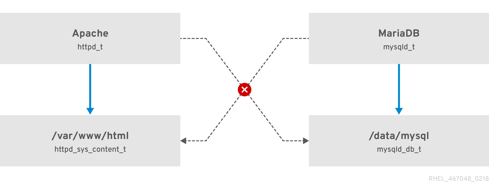

## Getting started with SELinux
### Introduction to SELinux
Security Enhanced Linux (SELinux) implements Mandatory Access Control (MAC). Every process and system resource has a special security label called an SELinux context.

**An example how can SELinux help to run Apache and MariaDB in a secure way.**

### Benefits of running SELinux
- All processes and files are labeled. 
- Fine-grained access control.
- SELinux policy is administratively-defined and enforced system-wide.
- Improved mitigation for privilege escalation attacks. 

### SELinux examples
- The default action is deny.
- SELinux can confine Linux users.
For example, mapping a Linux user to the SELinux user_u user, results in a Linux user that is not able to run unless configured otherwise set user ID (setuid) applications, such as `sudo` and `su`.

### SELinux architecture and packages
SELinux is a Linux Security Module (LSM) that is built into the Linux kernel. 

###  SELinux states and modes
```bash
getenforce
```
```bash
setenforce 0
```
In Red Hat Enterprise Linux, you can set individual domains to permissive mode while the system runs in enforcing mode. For example, to make the httpd_t domain permissive:
```bash
semanage permissive -a httpd_t
```

### Changing SELinux states and modes
The `sestatus` command returns the SELinux status and the SELinux policy being used:
```bash
sestatus
```
```bash
vi /etc/selinux/config
```

```bash
# This file controls the state of SELinux on the system.
# SELINUX= can take one of these three values:
#       enforcing - SELinux security policy is enforced.
#       permissive - SELinux prints warnings instead of enforcing.
#       disabled - No SELinux policy is loaded.
SELINUX=enforcing
# SELINUXTYPE= can take one of these two values:
#       targeted - Targeted processes are protected,
#       mls - Multi Level Security protection.
SELINUXTYPE=targeted
```
```bash
grep "SELinux is preventing" /var/log/messages
```

### Managing confined and unconfined users
#### Confined and unconfined users in SELinux
By default, all Linux users in Red Hat Enterprise Linux, including users with administrative privileges, are mapped to the unconfined SELinux user `unconfined_u`
```bash
user_u:user_r:user_t
```
Where:

`user_u`
Is the SELinux user.
`user_r`
Is the SELinux role.
`user_t`
Is the SELinux type.

To see the SELinux user mapping on your system, use the `semanage login -l` command as root:
```bash
semanage login -l
```
Confined users are restricted by SELinux rules explicitly defined in the current SELinux policy. Unconfined users are subject to only minimal restrictions by SELinux.

To list the available SELinux users, enter the following command:
```bash
seinfo -u
```
Note that the seinfo command is provided by the `setools-console` package, which is not installed by default

The security benefit of this is that, even though a Linux user is running unconfined, the application remains confined

### Roles and access rights of SELinux users
You can customize the permissions for confined users in your SELinux policy according to specific needs by adjusting booleans in the policy.

To list all SELinux users, their SELinux roles, and levels and ranges for MLS and MCS, use the `semanage user -l` command as `root`.

### To list all available roles, enter the seinfo -r command:
```bash
seinfo -r
```
### Confined non-administrator roles in SELinux
Install `selinux-policy-devel` to get more detailed descriptions 
```bash
semanage boolean -l
```

###  Confined administrator roles in SELinux

### Adding a new user automatically mapped to the SELinux unconfined_u user
Create user
```bash
useradd user1
```
```bash
id -Z
```

### Adding a new user as an SELinux-confined user

```bash
useradd -Z staff_u <example_user>
```
### Confining regular users in SELinux
By default, all Linux users in Red Hat Enterprise Linux, including users with administrative privileges, are mapped to the unconfined SELinux user ``unconfined_u``.

Display the list of SELinux login records
```bash
semanage login -l
```
Map the `__default__` user, which represents all users without an explicit mapping, to the `user_u` SELinux user:

```bash
semanage login -m -s user_u -r s0 __default__
```
Show the security context of the user’s current processes:
```bash
ps axZ
```
### Commands

There are multiple commands for managing the SELinux context for files, such as `chcon`, `semanage fcontext`, and `restorecon`.

**chcon**
Use the `chcon` command to change the context of a file or directory:
```bash


# View the current context of a file
ls -Z /path/to/file

# Change the context of a file
chcon -t httpd_sys_content_t /path/to/file

# Recursively change the context of a directory and its contents
chcon -R -t httpd_sys_content_t /var/www/html


```

**semanage**
```bash
# List current file context mappings
semanage fcontext -l

# Add a new file context mapping
semanage fcontext -a -t httpd_sys_content_t '/var/www/html/example(/.*)?'

# Apply the new file context mapping
restorecon -Rv /var/www/html/example

```

**restorecon**
```bash
# Restore the default SELinux context of a file
restorecon /path/to/file

# Recursively restore the default SELinux context of a directory and its contents
restorecon -R /var/www/html

```
List All File Contexts and Their Default Types (restorecon):
```bash
restorecon -n -v -R /

```

## Example
Temporary Changes: `chcon`
```bash
cd
touch file1
ls -Z file1
chcon -t samba_share_t file1
ls -Z file1 
restorecon -v file1
```
In this example, the previous type, `samba_share_t`, is restored to the correct, `user_home_t` type.
`restorecon` command reads the files in the `/etc/selinux/targeted/contexts/files/` directory, to see which SELinux context files should have.

### Changing a Directory and its Contents Types


```bash
mkdir /web
touch /web/file{1,2,3}
ls -dZ /web
chcon -R -t httpd_sys_content_t /web/
restorecon -R -v /web/
```

Persistent Changes: `semanage fcontext`
The `semanage fcontext` command is used to change the SELinux context of files. When using targeted policy, changes are written to files located in the `/etc/selinux/targeted/contexts/files/` directory:

- The `file_contexts` file specifies default contexts for many files, as well as contexts updated via `semanage fcontext`.
- The `file_contexts.local` file stores contexts to newly created files and directories not found in `file_contexts`.

```bash
touch /etc/file1
ls -Z /etc/file1
semanage fcontext -a -t samba_share_t /etc/file1
ls -Z /etc/file1
```

The `semanage fcontext -a -t samba_share_t /etc/file1` command adds the following entry to `/etc/selinux/targeted/contexts/files/file_contexts.local`

```bash
restorecon -v /etc/file1
```

### Deleting an added Context
```bash
semanage fcontext -d "/web(/.*)?"
```

### Network SErvices
```bash
semanage port -l |grep ssh
```
```bash
semanage port -m -t ssh_port_t -p tcp 23
```

### Reference
[Selinux](https://access.redhat.com/documentation/en-us/red_hat_enterprise_linux/8/html/using_selinux/managing-confined-and-unconfined-users_using-selinux#confined-and-unconfined-users_managing-confined-and-unconfined-users)

[SELinux Contexts](https://access.redhat.com/documentation/en-us/red_hat_enterprise_linux/6/html/security-enhanced_linux/chap-security-enhanced_linux-selinux_contexts)


